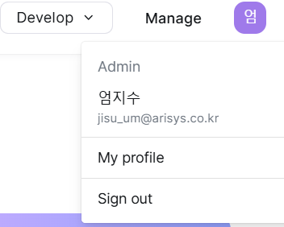
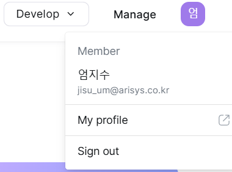
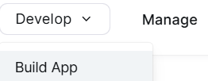
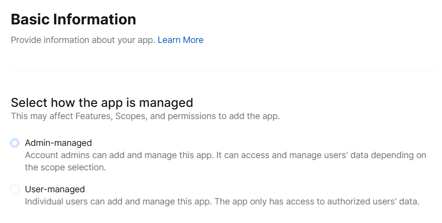

# oauth_zoom

Zoom API 를 사용하여 인증 및 토큰을 제공받기 위한 샘플 어플리케이션을 구현함.

## spec
* java 17
* spring boot 3.3.4
* spring security 6
* h2database
* lombok

## 사전준비
<h3> 1. admin 권한을 가진 계정이 필요</h3>

You have a Zoom account with permissions to create apps.
  VS 

<h3> 2. 앱생성 및 설정화면에서 데이터 수집 및 설정 </h3>

https://marketplace.zoom.us/

1. 생성
   * [Develop] > [General App] `Create`
   * [Manage] > [Build your app] > [Basic Information] > Select how the app is managed `필수⚠️ : Admin-managed`
        *  다르게 설정하면, Add Scopes 화면에서 `admin` 권한 사용불가. ( ex. 모든 사용자 정보 보기 user:read:list_users:admin)
        * 

2. `자동생성` 설정
   * [Manage] > [Build your app] > [Basic Information] > App Credentials
     * ZOOM_CLIENT_ID=F8vf_1h9S6Cv6Gy9uBaEQ 
     * ZOOM_CLIENT_SECRET=Bx92GZgbI8KOW3GWlgMA7MkTqc1bBvwU

3. `필수⚠️` 설정
   * [Manage] > [Build your app] > [Basic Information] > OAuth Information
     * ZOOM_REDIRECT_URI=http://localhost:8080/zoom/get/auth

<h3> 3. 앱 설정화면에서 필요권한 설정 </h3>

1. `필수⚠️` 설정  : [Manage] > [Build your app] > [Add Scopes]
   1. 미설정시, 
      * authorize code 요청시 사용자 권한확인 화면이 뜨지 않음.
      * code 는 발급되지만 해당 코드 사용해 accessToken 요청시 다음 오류가 반환됨 : ` "reason": "Bad Request","error": "invalid_request" }`
   2. 필요한 권한이 없으면,
      * accessToken 는 발급되지만 권한없음으로 api 호출불가.

## 주요 API
