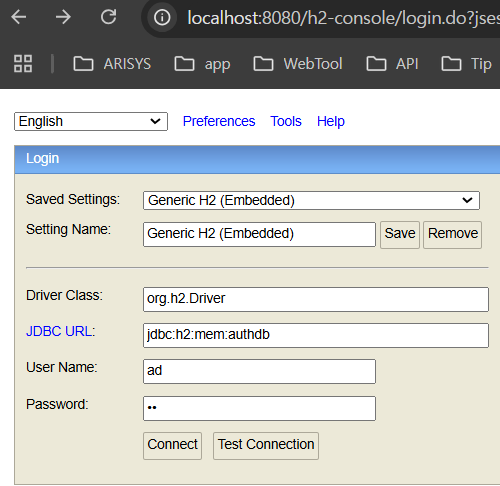

#h2-console

브라우저에서 실행되는 DataBase 를 사용하기 위함

### 주요설정

1. 의존성 : pom.xml
```
		<dependency>
			<groupId>com.h2database</groupId>
			<artifactId>h2</artifactId>
		</dependency>
```
2. 기본설정 : application.properties `오타주의!!!!!`
```
spring.h2.console.enabled=true
spring.datasource.url=jdbc:h2:mem:authDB
spring.datasource.driver-class-name=org.h2.Driver
spring.datasource.username=ad
spring.datasource.password=pw
```

3. 보안설정 : SecurityConfig

```java
    @Bean
    public SecurityFilterChain filterChain(HttpSecurity http) throws Exception {
    http.csrf(AbstractHttpConfigurer::disable)
            .headers(headers ->
                    headers.frameOptions(HeadersConfigurer.FrameOptionsConfig::sameOrigin)
            )
            .authorizeHttpRequests((authorize) -> authorize
                    .requestMatchers("/h2-console/**").permitAll());
    }
        
```


### 성공페이지
JDBC URL, User Name, Password 를 application.properties 와 동일하게 입력하고 `Connect` 클릭
