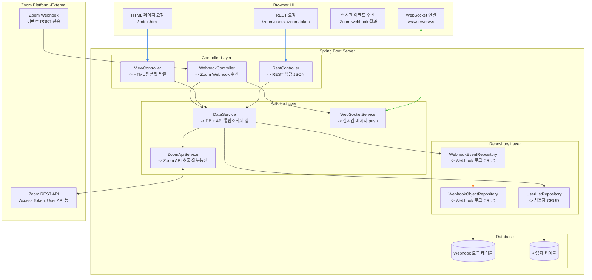
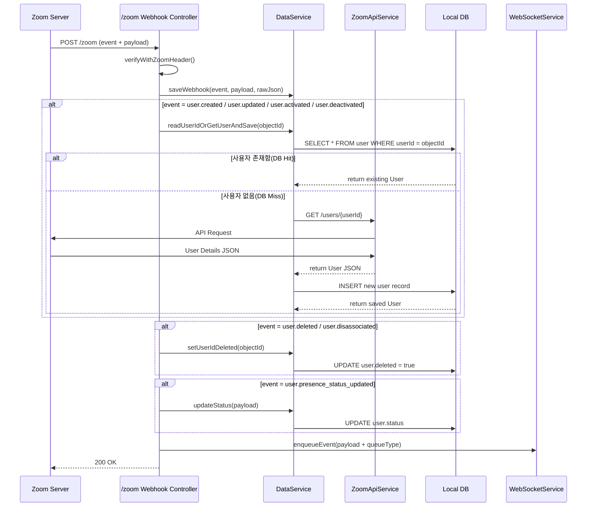

# ZOOM webhook 연동

zoom 에서 보내주는 실시간 이벤트를 받기 위함


### 설정화면에서 수신받을 이벤트 및 경로 설정

https://marketplace.zoom.us/
url 은 CA 인증받은 https://[DOMAIN] 형식이어야함.
https://doris-aquicultural-adequately.ngrok-free.dev/webhook/zoom

ngrok 을 사용해 CA인증된 도메인을 내 로컬포트 localhost:8080에 포워딩하여 테스트함.
https://dashboard.ngrok.com/get-started/setup/macos

```
ngrok config add-authtoken 33OjsKe0sTvLsRz5IzDyAsf18P7_7QzBFR1zjK658wFJSt5Dw
ngrok http 8080
```

### webhook 엔트포인트 검증 과정 <<endpoint.url_validation>>

zoom 에서 등록된 url 로 보낸 요청에 정해진 양식의 응답을 전달해야 이후 해당 경로로 웹훅 이벤트가 전달됨.
1. 서명 검증 : body 를 JSON 형식으로 직렬화하여 zoom 이 보낸 헤더의 x-zm-signature 값과 일치하는지 확인 
2. JSON 응답 : 3초이내에 plainToken 을 secret token 으로 해싱한 값을 body 에 담아 200 응답 전달 해야함.

```
{"payload":{"plainToken":"2oXY7bAKQLCwXDMECt8m_g"},"event_ts":1759205906459,"event":"endpoint.url_validation"}
v0=cc554ff6791064729e68faf78c9e97e9f49d8a1f2094deabbf1b22076a6dc187
{"plainToken":"2oXY7bAKQLCwXDMECt8m_g","encryptedToken":"7c8fb1a685a782598c47b2cc75da736108fb1d7ceb223837f7ae69c1bdefb3ac"}
```

검증 이후 받은 webhook 이벤트
```
{event=user.presence_status_updated, 
payload={account_id=RuKYKI0gRmioLXZxGXzq2Q, 
object={date_time=2025-09-30T04:22:35Z, 
email=strategos@arisys.co.kr, 
id=prgjvqabtrcaaxoq43x97a, presence_status=Available}}, 
event_ts=1759206155113}
```

### webhook 엔트포인트 검증 검증주기

웹훅 URL은 72시간마다 주기적으로 재검증됩니다. URL이 재검증에 실패하면 Zoom은 다음 일정에 따라 앱과 연결된 계정 소유자에게 알림 이메일을 보냅니다.
[ 연속으로 2번의 재검증 실패 > 첫 번째 알림 이메일 > 4번 연속으로 재검증에 실패 > 두 번째 알림 이메일 > 재검증이 6회 연속 실패 > 이벤트 구독을 비활성화 ]
웹훅 이벤트를 다시 수신하려면 앱 웹훅 엔드포인트 URL 설정으로 이동하여 웹훅을 다시 활성화하고, 필요한 경우 엔드포인트 URL을 업데이트한 후, '검증'을 클릭하여 엔드포인트 URL을 재검증하고 마지막으로 '저장'을 클릭하세요.


### 화면

1. ZoomController 생성시점에 서버토큰 자동발급
2. http://localhost:8080/list 에서 페이지 로드시점에 ajax('/api/users') 요청으로 전체 사용자 목록을 불러와 카드 생성 (97명)
3. 백엔드와 클라이언트 websocket 연결
4. 사용자의 상태 변경시 웹훅 이벤트를 백엔드가 받아서 queue 에 담았다가, 클라이언트에게 websocket 으로 전달
5. 수신한 클라이언트의 화면의 상태값 변경됨.

문제 : 최초 사용자 정보 호출시 모든 사용자의 상태가 default: active 로 표기되는 문제가 있음.

1. 카드 클릭시 User ID 값 확인. Status 선택하고, 상태변경 버튼클릭
2. api 요청 성공시 success 문자열 받음
3. zoom 처리 완료시 user.presence_status_updated 이벤트 받음. 화면 상태값 변경됨(붉은색 표시)

### 데이터 DB 저장

데이터 유지를 위해 h2.mem -> h2.file 로 변경. 인텔리제이 DB연동가능.

1. api 호출 후 userlist 테이블에 저장.
2. 웹에서 요청시 DB 조회, 데이터 없으면 api 호출.
3. update 설정으로 서버 재시작시에도 기존 데이터 유지.
4. 실시간 상태 변경 event 발생시 DB 업데이트

userlist 1개라도 조회되면 api 호출안됨.
-> 사용자 정보 변경 event 발생시, or 주기적으로 api 호출해 DB 업데이트 하는 배치서비스 필요.

### 에러 화면에 띄우기

관리를 위해 별도의 예외큐목록을 생성하여, 백엔드에서 발생하는 오류들을 사용자 화면에 출력함.
파싱을 거쳐 아래와 같이 출력됨.

```
event: error
message: findByEmail jisu_um@arisys.co.kr is NullPointerException
detail: Cannot invoke "me.test.oauth.entity.UserList.setStatus(String)" because "userStats" is null
```

### 이슈

1. 완료일자 2025.10.13
    개인계정에서 test_zoom@arisys.co.kr 로 계정을 변경한 후 webhook 검증 불가.
    원인 : WebhookController.secretToken 클래스변수값에 개인계정의 토큰값이 하드코딩 되어 있었음. 제거 후 정상동작
2. 식별자 email 2025.10.13
   사용자 정보를 구별하기 위한 userlist 테이블에서는 식별자로 id 를 사용중이나, 
   대소문자 혼동으로 인한 이슈가 있어 JPA 호출시에는 email 로 식별하고 있음.
   API 호출시 : userlist.id 값이 대소문자 혼용된 데이터가 조회됨.
   Webhook 이벤트 수신시 : presence_status_updated  소문자로만 이루어진 데이터가 조회됨.

### 존재하지 않는 사용자(2025.10.17)

1. 사용자 상태변경 webhook 이벤트를 받음.
2. 상태값을 DB에 업데이트하는 도중 일치하는 사용자 정보가 없어 NullPointerException
3. 사용자에게 error 전달. 사용자 추가조회 여부를 확인.
4. 사용자 요청시 api 호출하여 사용자정보를 DB에 저장.
5. 사용자에게 불러온 정보를 제공, 화면에 출력함.

### 사용자 추가

1. zoom.us/account/user 에서 사용자 추가
2. test_user_add@arisys.co.kr 생성 (줌폰 라이센스 미할당)
3. 웹훅 수신됨
4. zoom api 를 호출해 DB 정보를 업데이트 한다. /api/user/{email} or /api/user/ -> 조회 후 업데이트시 기존 실시간상태가 변경됨. -> 별도 테이블로 구성을 바꿀지 고민됨. 단일이라면 조회 - 수정 - 업데이트 하면 됨. 실시간 데이터 누락이 간혹 있을 수 있음.


### 웹훅
* zoomReceive user.created : {event=user.created, payload={account_id=RuKYKI0gRmioLXZxGXzq2Q, operator=test_zoom@arisys.co.kr, operator_id=lY4x7CVoR8S6L4FE45TNHg, creation_type=create, object={id=bdFD6relTFKtryY5sAqOMA, first_name=, last_name=, display_name=test_user_add@arisys.co.kr, email=test_user_add@arisys.co.kr, type=1}}, event_ts=1760337064042}
* zoomReceive user.created : {event=user.created, payload={account_id=RuKYKI0gRmioLXZxGXzq2Q, operator=test_zoom@arisys.co.kr, operator_id=lY4x7CVoR8S6L4FE45TNHg, creation_type=create, object={id=bdFD6relTFKtryY5sAqOMA, display_name=test_user_add@arisys.co.kr, email=test_user_add@arisys.co.kr, type=1}}, event_ts=1760342138985}
* zoomReceive user.signed_out : {event=user.signed_out, payload={account_id=RuKYKI0gRmioLXZxGXzq2Q, object={id=WfW3epgHTnGfUWLgGkYiGg, client_type=browser, date_time=2025-10-17T06:05:48Z, version=-, login_type=100, email=ysshim@arisys.co.kr}}, event_ts=1760681148192}
* zoomReceive user.signed_in : {event=user.signed_in, payload={account_id=RuKYKI0gRmioLXZxGXzq2Q, object={id=t2bS3bJKRamtTrbWCKMVtA, client_type=browser, date_time=2025-10-17T06:06:37Z, version=-, login_type=100, email=jisu_um@arisys.co.kr}}, event_ts=1760681197150}
* zoomReceive user.updated : {event=user.updated, event_ts=1761185656764, account_id=RuKYKI0gRmioLXZxGXzq2Q, object={id=vs0aVx7zRju8I2wBInA7cw, dept=test}, old_object={id=vs0aVx7zRju8I2wBInA7cw, dept=}, time_stamp=1761185656764}
보류중 사용자가 이메일 인증시, 생성시 등록했던 dept 설정값 변경에 따른 user.updated 이벤트가 발생함.
* zoomReceive user.deactivated : {event=user.deactivated, payload={account_id=RuKYKI0gRmioLXZxGXzq2Q, operator=test_zoom@arisys.co.kr, operator_id=lY4x7CVoR8S6L4FE45TNHg, object={id=vs0aVx7zRju8I2wBInA7cw, first_name=/학생, last_name=엄지수, email=ashasg@knou.ac.kr, type=1}}, event_ts=1761186173638}
사용자 비활성화 처리로 웹훅 발생.
* zoomReceive user.activated : {event=user.activated, payload={account_id=RuKYKI0gRmioLXZxGXzq2Q, operator=test_zoom@arisys.co.kr, operator_id=lY4x7CVoR8S6L4FE45TNHg, object={id=vs0aVx7zRju8I2wBInA7cw, first_name=/학생, last_name=엄지수, email=ashasg@knou.ac.kr, type=1}}, event_ts=1761186224746}
사용자 활성화 처리로 웹훅 발생
* zoomReceive user.updated : {event=user.updated, payload={account_id=RuKYKI0gRmioLXZxGXzq2Q, operator=test_zoom@arisys.co.kr, operator_id=lY4x7CVoR8S6L4FE45TNHg, object={id=vs0aVx7zRju8I2wBInA7cw, first_name=/학생, last_name=엄지수, display_name=엄지수/202534-361694, pic_url=https://arisys-co-kr.zoom.us/p/v2/7d1b16d2bfdf767071997f6ad040ca3c9ef6d9330c35ec0bb7ac5b08383737ed/e4443598-7600-48a2-97ea-0e5821fd6d49-8097, pmi=6351440719, use_pmi=false, timezone=Asia/Seoul, language=ko-KO}, old_object={id=, first_name=, last_name=, display_name=, pic_url=, timezone=, language=}, time_stamp=1761186658371}, event_ts=1761186658371}
* zoomReceive user.deleted : {event=user.deleted, payload={account_id=RuKYKI0gRmioLXZxGXzq2Q, operator=test_zoom@arisys.co.kr, operator_id=lY4x7CVoR8S6L4FE45TNHg, object={id=vs0aVx7zRju8I2wBInA7cw, first_name=/학생, last_name=엄지수, email=ashasg@knou.ac.kr, type=1}}, event_ts=1761186658403}
활성화된 사용자 삭제시, 웹훅 발생, 팝업 뜸 (The request of deleting 1 user at 10/23/2025 11:30:58 AM has been processed)
* zoomReceive user.disassociated : {event=user.disassociated, payload={account_id=RuKYKI0gRmioLXZxGXzq2Q, operator=test_zoom@arisys.co.kr, operator_id=lY4x7CVoR8S6L4FE45TNHg, object={id=Wn7ZZ5glRnWrnByQ2_jkuQ, first_name=new, last_name=Test, email=ashasg@knou.ac.kr, type=1}}, event_ts=1761551627513}
zoom api 요청으로 사용자를 삭제처리 시 웹훅 발생 : 기존 계정정보는 유지하돼, 조직의 사용자 목록에서 제거됨.
* zoomReceive user.created : {event=user.created, payload={account_id=RuKYKI0gRmioLXZxGXzq2Q, operator=test_zoom@arisys.co.kr, operator_id=lY4x7CVoR8S6L4FE45TNHg, creation_type=create, object={id=Wn7ZZ5glRnWrnByQ2_jkuQ, first_name=new, last_name=Test, display_name=new Test, email=ashasg@knou.ac.kr, type=1}}, event_ts=1761553396588}
zoom api 요청으로 사용자 등록처리 시 웹훅 발생 : 일치하는 이메일의 zoom 계정이 존재하는 경우, 새로 기입한 정보는 무시되고 기존 계정정보가 유지됨. 보류중 목록에 추가됨.
보류중인 사용자는 삭제 불가 1001 : User does not exist: $userId.


### webhookEvent 엔티티 생성(2025.10.17)
반복되는 구조의 웹훅을 파싱하기 간편하게 하면서, 실시간으로 DB 에 이벤트로그를 저장하기 위한 중첩된 엔티티 생성.
WebhookEvent.java -> ~~Payload.java~~ -> Object.java
zoomReceive user.presence_status_updated : {event=user.presence_status_updated, payload={account_id=RuKYKI0gRmioLXZxGXzq2Q, object={date_time=2025-10-17T06:41:35Z, email=jisu_um@arisys.co.kr, id=t2bs3bjkramttrbwckmvta, presence_status=Available}}, event_ts=1760683295459}

### DB에서 대소문자 무시 검색
추대소문자를 구분하지 않는 DB(H2) 레벨 특성특성으로 인해,  WebhookObject 테이블의 기본키 중복방지를 위해 대체 Long object_id 를 기본키로 사용함.
반대로 JPA는 대소문자를 구분하므로 기본키로 테이블 조회시 아래 함수 사용.

H2 DB 또는 MySQL에서 컬럼을 VARCHAR_IGNORECASE 또는 COLLATE로 생성
조회 시 lower(id) 또는 UPPER(id)를 사용하여 비교
@Query("SELECT w FROM WebhookObject w WHERE LOWER(w.id) = LOWER(:id)")
Optional<WebhookObject> findByIdIgnoreCase(@Param("id") String id);
장점: 원본 대소문자 유지 가능
단점: DB마다 지원 방식 차이가 있고, 인덱스 효율 저하 가능

## zoom Controller, Service 클래스구분(2025.10.22)
webhook, api, db, websocket, restapi  등 교차되는 요청들이 많아 컨트롤러 별 역할 및 요청목록을 명확하게 분리할 필요가 있음.
### 3계층 구조(Controller → Service → Repository)
Controller: HTTP 요청 처리 담당 : 3ea
Service: 비즈니스 로직 담당 : 3ea
Repository: 데이터 액세스 담당 : 3ea

* RestController - 브라우저 사용자의 요청시, ResponseEntity 제공 
* ViewController - 브라우저 사용자의 요청시, 정적 html 화면 및 model 담은 페이지명 반환.
* WebhookController - Zoom 사이트에서 사용자변경사항을 webhook 으로 제공함. webhook 파싱해서 event 종류별로 다른 서비스를 호출함. 

* ZoomApiService - Zoom 사이트에 API 요청하고, 받은 데이터 String Json 형태로 반환.( 외부 연동 전용 )
* DataService - 테이블 데이터와 API 데이터의 통합조회하여 DTO 로 제공함. ( db 없으면 api 호출 후 저장하고 반환함) 
* WebSocketService - 큐를 관리하며, 사용자에게 websocket 전달

* UserListRepository - zoom Api 에서 받은 사용자정보 저장
* WebhookEventRepository - zoom Webhook 에서 받은 이벤트정보 저장
* WebhookObjectRepository - zoom Webhook 에서 받은 이벤트 내부의 다양한 상세 데이터 저장

  WebhookController → WebhookEventService 호출 부분은
  I/O 부하가 크다면 @Async 또는 메시지큐(kafka, redis pub/sub)로 분리도 고려 가능.




## 사용자 CRUD (논리 삭제)

사용자 추가,수정,활성화,비활성화 webhook -> object.id 추출해 zoom api 로 사용자 정보 요청, DB 저장
사용자 삭제 webhook -> object.id 추출해 사용자 조회, userlist.deleted 값을 true 로 수정.
사용자 전체 다시조회 -> DB 에만 있으면 deleted 처리, 대부분 데이터는 api 기준으로 업데이트, status 값만 DB 기준으로 저장.

webhook 반응있는 정보
### 프로필 편집
* 성 : new `ok`=> "first_name" : "new"
* 이름 : Test `ok`=> "last_name" : "Test"
* 표시 이름 : new Test `ok`=> "display_name" : "new Test"
* 언어 : 한국어 `ok`=> "language":"en-US" -> "language" : "ko-KO"

### 사용자 편집
* 라이선스 및 추가 기능 : Zoom Meetings 기본 제거 ->  "type" : 4, "settings":{"feature":{"meeting_capacity":0}}} : 300 에서 0으로 값변경됨. user API 정보조회에는 type 만 보임 라이센스는 별도 /users/{userId}/settings api 조회 필요.
* 사용자 역할 : Test `ok` => "role_id" : "RkMP5mdHqTgGL2dOx_vOg3Q"
* 부서 : deleted_edit `ok` => "dept"
* 관리자 : ZOOM API `no` => "manager" : "test_zoom@arisys.co.kr"
* 직함 : tester `no` => "job_title" : "tester",
* 위치 : Seoul `no` => "location" : "Seoul"
* 비용 센터 : center `no` => "cost_center" : "center"
* 사용자 그룹 : 1 `no` => "group_ids" : [ "9QHk9NYERjadNIJf46XnfQ" ]

### type 별 라이센스 차이
* 1 : Zoom Meetings 기본 
* 2 : Zoom Workplace 비즈니스
* 4: 할당된 라이선스 없음

## Webhook 이벤트 기반 사용자 정보 동기화 로직
1. Zoom 서버가 사용자 관련 이벤트(user.created, user.updated, user.deleted, 등)를 Webhook 으로 전송한다.
2. 서버는 Webhook 요청을 /zoom 엔드포인트에서 수신한 후, x-zm-signature, x-zm-request-timestamp 헤더로 정상 Webhook 여부를 검증한다. 
   * 이벤트 종류에 따라 분기 처리:
   * (1) user.created, user.updated, user.deactivated, user.activated 
      이벤트 payload 에서 objectId(userId) 를 추출하여 readUserIdOrGetUserAndSave(userId) 호출: Zoom API GET /users/{userId} 로 최신 사용자 정보를 조회
      조회된 사용자 정보를 로컬 DB(UserList) 에 업데이트 또는 Insert해 최종적으로 DB 의 사용자 상태값과 프로필 정보를 Zoom 기준으로 정확히 동기화한다.
   * (2) user.deleted, user.disassociated
       사용자 상세 조회 수행 안 함.
       로컬 DB 에서 해당 userId 의 deleted = true 로 설정하며 논리적 삭제처리한다.
       DB 업데이트 실패 시 WebSocket 으로 관리자에게 오류 알림을 전송한다.
   * (3) user.presence_status_updated
       payload 내 presence 상태 값만 DB 에 반영하여 status 필드만 최신화한다.
3. Webhook으로 수신된 payload + 이벤트명을 queueType 으로 WebSocket 큐에 전달하여 UI 실시간 반영한다.
4.  마지막으로 Webhook 응답으로 HTTP 200 OK를 즉시 반환한다.



## 사용자 요청 기반 사용자 CRUD 처리 로직
Zoom API 호출 성공 후에는 반드시 GET /users/{userId} 또는 삭제 상태를 기준으로 DB 를 최종적으로 Zoom 상태와 일관되도록 보정한다.

1. 사용자 상세 조회	GET /users/{userId}	Zoom 응답 내용을 화면에 표시. (필요 시 DB 동기화 수행 가능)
2. 사용자 생성	POST /users	생성 성공 시 → GET /users/{userId} 재조회 → DB 에 신규 저장
3. 사용자 수정	PATCH /users/{userId}	수정 성공 시 → GET /users/{userId} 재조회 → DB 정보 갱신
4. 사용자 삭제	DELETE /users/{userId}	삭제 성공 시 → DB 에서 deleted = true 로 표시 (소프트 삭제)